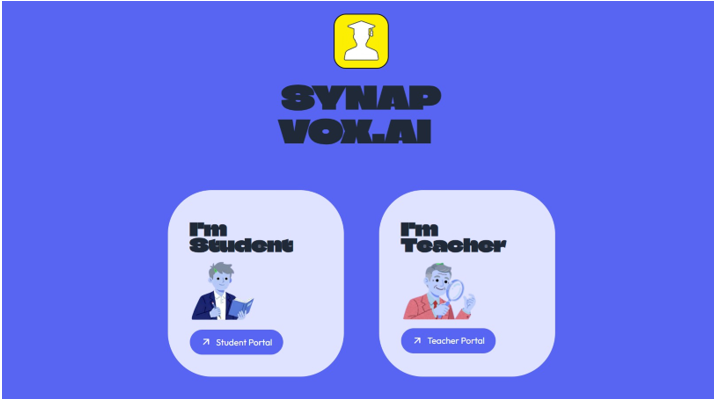

# 🎙️ SYNAPVOX AI - AI-Powered Attendance System

> An AI-powered attendance management platform that combines **Face Recognition** and **Voice Recognition** to automate student attendance with high accuracy and minimal manual effort.


---

## 🌐 Live Demo

🚀 **Landing Page**
[Visit SYNAPVOX AI](https://snap-vox-ai-landing-page.vercel.app/)

## 🎥 Project Demo Video

[](https://github.com/DurgeshNandan1105/SYNAPVOX-AI/blob/main/Demo%20video.mp4)

👉 **Click the image above to watch the full demo**

---

## 🎯 Highlights

* 🤖 AI-Powered Face Recognition Attendance
* 🎤 Voice Biometrics Verification
* ☁️ Supabase Cloud Database Integration
* 📊 Real-Time Attendance Tracking
* 👨‍🏫 Teacher Dashboard
* 👨‍🎓 Student Dashboard
* 🔒 Secure Authentication with bcrypt
* 📈 Attendance Analytics & Reporting

---

## 🚀 Overview

Traditional attendance systems are time-consuming, prone to proxy attendance, and difficult to manage at scale.

**SYNAPVOX AI** solves these challenges by leveraging Artificial Intelligence to verify student identity using facial and voice biometrics.

### Core Capabilities

✅ Face Recognition

✅ Voice Recognition

✅ Secure Cloud Database

✅ Real-Time Attendance Processing

✅ Teacher & Student Management Dashboard

✅ Attendance Reports & Analytics

The system provides a seamless, secure, and intelligent way to record attendance while significantly reducing manual workload.

---

## ✨ Key Features

### 👤 Face Recognition Attendance

* Detects and identifies students using facial embeddings.
* Supports multiple student registrations.
* Fast and accurate attendance marking.
* Reduces proxy attendance.

### 🎤 Voice Recognition Attendance

* Uses speaker embeddings for voice-based verification.
* Prevents identity spoofing.
* Alternative biometric authentication method.

### 📊 Attendance Analytics

* View attendance records instantly.
* Generate attendance reports.
* Track student participation.
* Monitor attendance trends.

### 👨‍🏫 Teacher Dashboard

* Create and manage subjects.
* Enroll students.
* Share subject codes.
* View attendance summaries.
* Access attendance reports.

### 👨‍🎓 Student Dashboard

* Join subjects using enrollment codes.
* Mark attendance.
* View attendance history.
* Access subject information.

### ☁️ Cloud Integration

* Secure cloud database using Supabase.
* Real-time synchronization.
* Scalable architecture.

---

## 🏗️ System Architecture

```text
Student
   │
   ├── Face Recognition Pipeline
   │
   ├── Voice Recognition Pipeline
   │
   ▼
Identity Verification
   │
   ▼
Attendance Processing
   │
   ▼
Supabase Database
   │
   ▼
Teacher Dashboard & Reports
```

## 🧠 AI Technologies Used

### Face Recognition

* dlib
* face_recognition_models
* scikit-learn
* NumPy

### Voice Recognition

* Librosa
* Resemblyzer

### Machine Learning Techniques

* Facial Embedding Extraction
* Speaker Embedding Extraction
* Similarity Matching
* Identity Verification
* Classification Techniques

---

## 🛠️ Tech Stack

### Frontend

* Streamlit

### Backend

* Python

### Database

* Supabase

### Authentication

* bcrypt

### Machine Learning

* Scikit-learn
* Dlib
* Face Recognition Models
* Resemblyzer

### Image Processing

* Pillow

### Data Processing

* NumPy
* Pandas

### QR Code Generation

* Segno

---

## 📂 Project Structure

```bash
src/
│
├── components/
│   ├── dialog_add_photo.py
│   ├── dialog_auto_enroll.py
│   ├── dialog_voice_attendance.py
│   ├── dialog_attendance_results.py
│   ├── dialog_create_subject.py
│   ├── dialog_enroll.py
│   ├── dialog_share_subject.py
│   ├── footer.py
│   ├── header.py
│   └── subject_card.py
│
├── database/
│   ├── config.py
│   └── db.py
│
├── pipelines/
│   ├── face_pipeline.py
│   └── voice_pipeline.py
│
├── screens/
│   ├── home_screen.py
│   ├── teacher_screen.py
│   └── student_screen.py
│
└── ui/
    └── base_layout.py

app.py
requirements.txt
README.md
```

## ⚙️ Installation

### Clone Repository

```bash
git clone https://github.com/DurgeshNandan1105/SYNAPVOX-AI.git

cd SYNAPVOX-AI
```

### Create Virtual Environment

```bash
python -m venv venv
```

### Activate Environment

Windows

```bash
venv\Scripts\activate
```

Linux / macOS

```bash
source venv/bin/activate
```

### Install Dependencies

```bash
pip install -r requirements.txt
```

### Configure Environment Variables

Create a `.env` file:

```env
SUPABASE_URL=your_supabase_url
SUPABASE_KEY=your_supabase_key
```

### Run Application

```bash
streamlit run app.py
```

---

## 🎯 Real-World Applications

* Schools
* Colleges
* Universities
* Coaching Institutes
* Corporate Training Programs
* Employee Attendance Systems
* Smart Campus Solutions

---

## 🔒 Security Features

* Password Hashing using bcrypt
* Secure Authentication
* Identity Verification
* Cloud Database Security
* Reduced Proxy Attendance
* Biometric Verification

---

## 📈 Future Enhancements

* QR Attendance Support
* Mobile Application
* Multi-Factor Authentication
* Attendance Prediction Analytics
* Admin Dashboard
* Live Classroom Monitoring
* Face Anti-Spoofing Detection
* AI-Based Attendance Insights

---

## 📊 Project Impact

### Problems Solved

* Eliminates manual attendance tracking.
* Reduces attendance fraud.
* Improves attendance accuracy.
* Saves classroom time.
* Provides real-time attendance analytics.

### Skills Demonstrated

* Artificial Intelligence
* Machine Learning
* Computer Vision
* Voice Biometrics
* Full-Stack Development
* Cloud Integration
* Database Management
* Authentication Systems

---

## 👨‍💻 Author

### Durgesh Nandan

AI & Full-Stack Developer

**Technical Skills**

* Python
* Machine Learning
* Computer Vision
* Deep Learning
* Streamlit
* Supabase
* Data Analysis
* Cloud Applications

GitHub: https://github.com/DurgeshNandan1105

---

## ⭐ Why This Project Stands Out

Unlike traditional attendance systems, SYNAPVOX AI combines **Computer Vision**, **Voice Biometrics**, and **Cloud Computing** into a single intelligent platform.

The project demonstrates the practical application of Artificial Intelligence for identity verification, biometric authentication, and educational technology, making it highly relevant for modern AI-powered systems.
